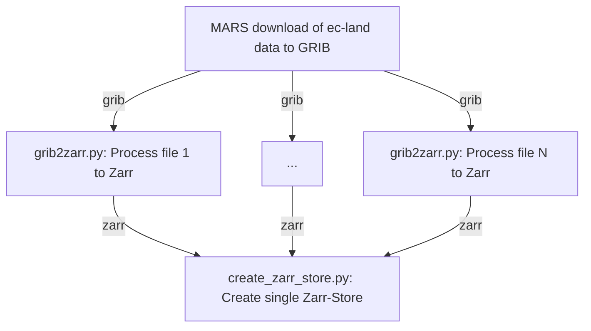

# ai-land data processing and model training

This project is setup to create a Machine Learning database for the land surface, with data coming from the ec-land model. We deal with grabbing data from Mars as GRIB files, converting these GRIB files to Zarr and then finally concatenating these into a single Zarr-Store with a predefined chunking strategy.

## Grabbing data from Mars

Some more info here...

## Converting GRIB to Zarr

The `src/grib2zarr.py` file converts GRIB files to Zarr using the `config.yaml` file as a config for the different model streams. Wethen concatenate these into a single Zarr-store.

## Converting netCDF to Zarr

The `src/nc2zarr.py` file converts netcdf files to Zarr using the `config.yaml` file as a config for the different model streams. Here we are extracting preprocessed ec-land model forcing from the `/ec/fwsm/lb` drive.

## Example data processing workflow

