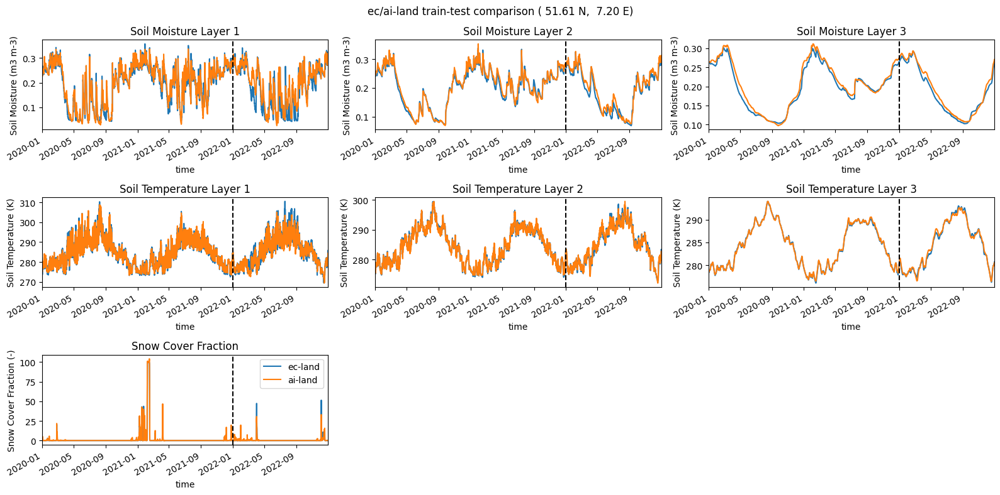

# ai-land data processing and model training

This project is setup to create a Machine Learning database for the land surface, with data coming from the ec-land model. We deal with grabbing data from Mars as GRIB files, converting these GRIB files to Zarr and then finally concatenating these into a single Zarr-Store with a predefined chunking strategy.

To install the project in a virtual environment you can do the following:
```bash
python3 -m venv --system-site-packages ec_land_db
source ec_land_db/bin/activate
pip install -e .
```
You may also want to install the kernel to be accesible with Jupyter notebooks using:
```bash
ipython kernel install --user --name=ec_land_db
```

## Data Processing

### Grabbing data from Mars

We use the `shell_scripts/mars_req.sh` to grab the monthly ec-land model output from Mars in GRIB format.   

### Converting GRIB to Zarr

The `ec_land_db/grib2zarr.py` file converts GRIB files to Zarr using the `config.yaml` file as a config for the different model streams. 

### Converting netCDF to Zarr

The `ec_land_db/nc2zarr.py` file converts netcdf files to Zarr. Here we are extracting preprocessed ec-land model meteorological forcing from the `/ec/fwsm/lb` drive using the `shell_scripts/process_forcing.sh` file.

### Concatenating to single Zarr-Store

Once we have extracted an processed the monthly ec-land model output we can then concatenate this into a single Zarr-Store with a chunking strategy as defined in the `config.yaml`. Here we use the `dask-jobqueue` `SLURMCluster` to create a large Dask cluster for rechunking and saving our consolidated Zarr-Store. We show the steps for this in the notebook:

[notebooks/create_zarr_store.ipynb](notebooks/create_zarr_store.ipynb "Concatenating Zarr-Store")


### Exploring the database

With the large ML database created we can inspect and plot different features/variables. We give some examples of this with `xarray` in the notebook:

[notebooks/explore_database_example.ipynb](notebooks/explore_database_example.ipynb "Database inspection")

### Example data processing workflow


## Machine Learning Model Training

Once we have downloaded and processed our dataset into Zarr format we can start testing ML models to emulate the model. In this project we provide some reduced example 6-hourly data and an example of how we could go about training an emulator on this:

[notebooks/train_ai_land_example.ipynb](notebooks/train_ai_land_example.ipynb "ai-land")

In the below figure we show how the machine learning emulator "ai-land" perfroms compared to the full ec-land model for a three year period. Here we have trained the model on the initial two years and then continue running the model into the third year to judge against completely independent data. We can see the emulator is performing exceptionally well. Even after 4380 applications we find very little compounding errors.



